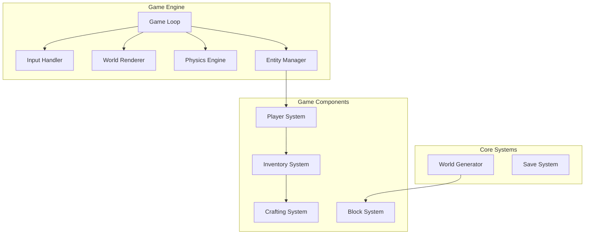
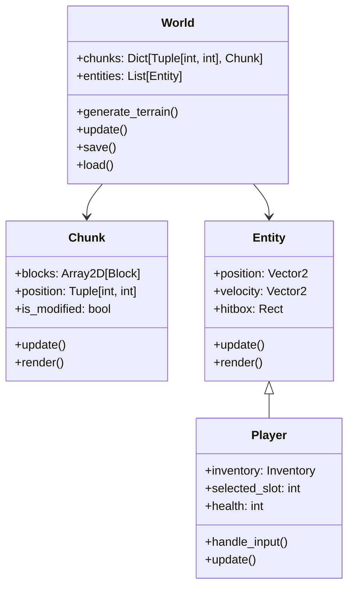

# Terraria-like Game Architecture

## 1. Core Technologies
- Language: Python
- Graphics: Pygame (for 2D rendering and window management)
- Physics: Custom implementation for tile-based physics

## 2. Core Systems Design

### 2.1 Game Engine
- **Game Loop**
  - Fixed time step updates (60 FPS)
  - Separate update and render cycles
  - Input processing
  - State management

- **World Renderer**
  - Tile-based rendering system
  - Viewport management
  - Layer system (background, midground, foreground)
  - Sprite management

- **Physics Engine**
  - Collision detection (AABB)
  - Gravity simulation
  - Block-based collision handling
  - Entity movement

### 2.2 World System
- **World Generator**
  - Procedural terrain generation
  - Biome system
  - Resource distribution
  - Cave generation

- **Block System**
  - Block types and properties
  - Block interactions
  - Block states

### 2.3 Entity System
- **Entity Manager**
  - Entity lifecycle management
  - Entity-component system
  - Collision groups
  - Update priority handling

### 2.4 Player System
- **Player Controller**
  - Movement controls
  - Tool/block interactions
  - Animation states
  - Camera following

### 2.5 Inventory & Crafting
- **Inventory System**
  - Item storage
  - Item stacking
  - Quick slots
  - Item types

- **Crafting System**
  - Recipe management
  - Crafting interface
  - Resource requirements
  - Crafting categories

## 3. Data Structure

## 4. Implementation Phases

1. **Phase 1: Core Engine** (Week 1)
   - Basic game loop
   - Window management
   - Input handling
   - Simple block rendering

2. **Phase 2: World Generation** (Week 2)
   - Terrain generation
   - Block system
   - Basic physics
   - World saving/loading

3. **Phase 3: Player Systems** (Week 2-3)
   - Player movement
   - Block interaction
   - Basic inventory
   - Camera following

4. **Phase 4: Crafting & Items** (Week 3-4)
   - Item system
   - Inventory UI
   - Basic crafting
   - Tool system

## 5. Dependencies
- Python 3.8+
- Pygame 2.0+
- NumPy (for efficient array operations)
- JSON (for save data)