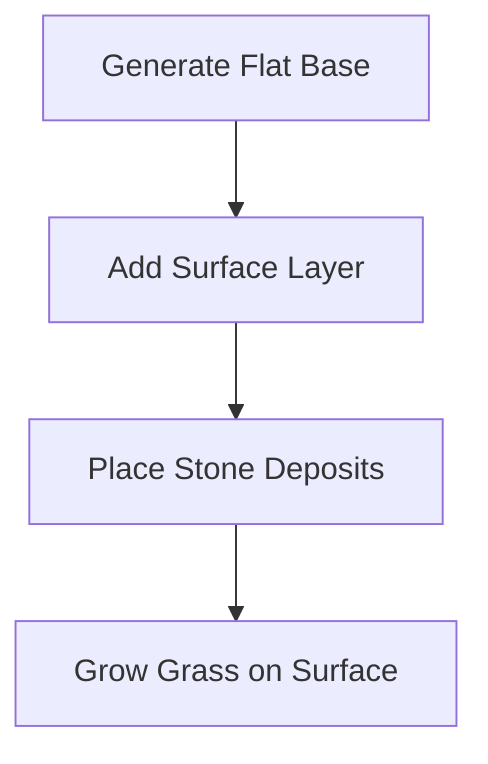
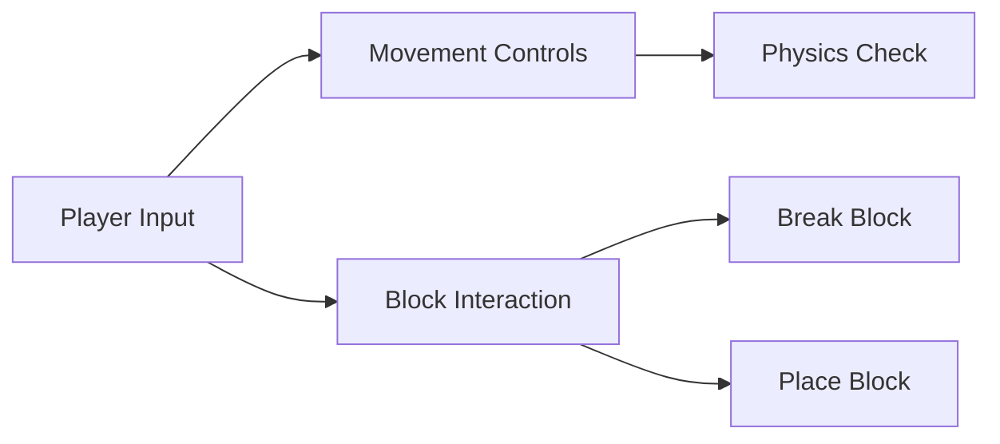
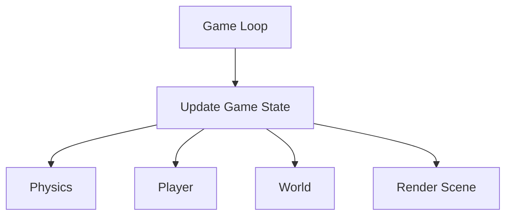

# Terraria-like Game MVP Plan

## Core Specifications

### Display
- Block size: 32x32 pixels
- Screen size: 800x600 pixels
- Initial world size: 100x100 blocks (easily expandable)

### Basic Block Types
1. Dirt
2. Stone
3. Grass (appears on top of dirt)
4. Air (empty space)

## MVP Features

### 1. World Generation

- Simple terrain with slight height variations
- Basic underground stone distribution
- Grass grows on surface dirt blocks

### 2. Player Mechanics

- Left/Right movement
- Jumping
- Break blocks (left click)
- Place blocks (right click)
- Simple collision detection

### 3. Game Systems

## Testing Plan

### Unit Tests
1. World Generation
   - Test terrain generation consistency
   - Validate block placement
   - Check world boundaries

2. Player Physics
   - Test collision detection
   - Verify movement calculations
   - Jump mechanics validation

3. Block Interactions
   - Test block breaking
   - Test block placing
   - Validate block updates

### Integration Tests
1. Player-World Interaction
   - Movement through world
   - Block modification effects
   - World bounds handling

### Manual Testing Checkpoints
- [ ] Player can move smoothly
- [ ] Jumping feels responsive
- [ ] Block breaking works
- [ ] Block placing works
- [ ] No physics glitches
- [ ] World generates correctly
- [ ] Game performance is stable

## Implementation Order

1. Core Setup (Day 1)
   - Window creation
   - Basic game loop
   - Input handling

2. World System (Day 2)
   - Block system
   - World generation
   - Basic rendering

3. Player System (Day 3)
   - Player movement
   - Physics & collision
   - Block interaction

4. Polish & Testing (Day 4)
   - Bug fixes
   - Performance optimization
   - Final testing

## Success Criteria
- Stable 60 FPS performance
- No game-breaking bugs
- Smooth player movement
- Reliable block interaction
- Consistent world generation